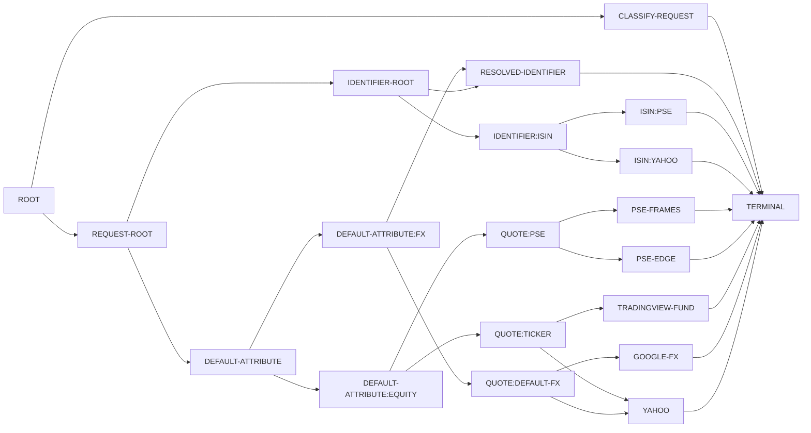
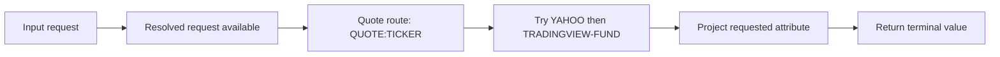
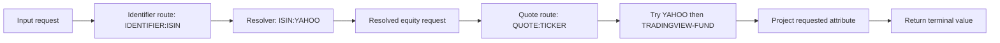

# Execution Graph Compilation

## Summary

Add a compilation step from the current descriptive routing graph into a
concrete execution graph.

The key end-state is that execution should completely move into the compiled
graph. `ResolveFlow` should stop being the place where routing-specific runtime
handoff logic and compatibility scaffolding live. Instead, it should hold or
expose the descriptive graph, while a compiler produces an execution graph that
the engine can run directly.

This is a follow-on design note, not a correction to the current active docs.
[`final-dag-shape-redesign.md`](./final-dag-shape-redesign.md) and
[`resolve-flow-rendering.md`](./resolve-flow-rendering.md) still describe the
current implementation correctly. This document describes the next phase after
that current shape.

## Problem

The current runtime shape is structurally simpler than earlier iterations, but
it still mixes together two concerns:

- description of the routing graph
- runtime execution behavior

That mixed shape shows up in places such as:

- hard-coded awareness of authored ids like `RESOLVED-IDENTIFIER` and
  `DEFAULT-ATTRIBUTE:FX`
- bootstrap logic that knows where request classification hands off to
  identifier resolution and then to attribute routing
- execution semantics that are still partially implicit in plan objects and
  request-resolution glue rather than being fully represented in graph form

The current `ResolveFlow` shape is therefore a transitional runtime form, not
the final execution architecture.

## Architectural Position

For the current implementation, the active model is still:

1. authored DAG data
2. `ResolveFlow` exposing `Graph.View`

This document proposes a later execution layer behind that public descriptive
surface:

1. authored DAG data
2. descriptive graph surface (`Graph.View`, exposed by `ResolveFlow`)
3. compiled execution graph
4. execution engine

That means this note does not propose restoring an older public structural DAG
layer. The public graph surface can remain small even if execution later moves
to a more explicit compiled form underneath it.

## Goals

- Keep the current descriptive routing graph as a high-level description form.
- Add a compiler that translates that description into a concrete execution
  graph.
- Move execution semantics completely into the compiled graph.
- Remove runtime dependence on HOODLEFINANCE-specific authored node ids beyond
  purely structural graph boundaries.
- Make handoff semantics explicit between:
  - request classification
  - identifier resolution
  - downstream attribute routing
- Preserve current routing behavior while changing where execution knowledge
  lives.

## Non-Goals

- Redesign routing semantics from scratch.
- Replace the current authored graph or `DagPlan` shape in this step.
- Redesign CLI graph rendering.
- Introduce browser/runtime-host changes.
- Solve every source-override and source-introspection design problem in the
  same pass.

## Proposed Design

### Current Phase Boundary

The current graph/runtime boundary is effectively:

- authored routing definition
- descriptive routing graph
- runtime execution through `ResolveFlow` and plan objects

This document adds an explicit compiled step between description and execution:

- authored routing definition
- descriptive routing graph
- compiled execution graph
- execution engine

### Compiler Role

The compiler should read the descriptive routing graph plus the already-derived
runtime semantics needed for execution and emit a concrete execution graph.

That compiler should:

- translate descriptive graph nodes into execution nodes
- make data handoffs explicit
- encode execution ordering and fan-out/fan-in structure directly in the
  compiled graph
- leave routing choice authority in the descriptive graph and derived planning
  data rather than re-deciding routing during execution
- remain a mechanical lowering step from descriptive structure to executable
  structure, not a second routing-policy engine

The compiler is allowed to know how descriptive routing concepts map into
execution concepts. It should not invent new routing policy.

This note intentionally does not fix the compilation granularity yet. The
compiled execution graph might end up being:

- a request-specific graph
- a partially specialized graph
- another deterministic compiled form derived from the descriptive graph plus
  request/planning inputs

The important architectural point is that execution semantics should live in
the compiled form, not in `ResolveFlow` bootstrap logic.

### Current Routing Graph

Before looking at compiled outputs for individual requests, it helps to keep
the descriptive routing graph in view as the stable routing surface the
compiler starts from.

The current graph below is the actual Mermaid output from the TypeScript CLI:
`node tools/_shared/cli-ts.js --graph --output=mermaid`



This is still the descriptive routing graph, not the future compiled execution
graph. The point of the examples below is to show how specific requests would
compile from this shared graph into more explicit executable forms.

### Worked Examples

These examples use the current `ResolvePlan` field names because that is the
most concrete plan surface in the code today.

The compiled outputs below are illustrative. They show the kind of explicit
execution structure this document is aiming for, not a frozen execution-node
taxonomy.

### Example 1: Direct Equity Quote

Request:

```text
GOOG price
```

Current-style routing plan:

```ts
{
  requestInput: {
    identifier: "GOOG",
    attribute: "price",
    classification: "equity",
  },
  resolvedRequest: {
    requestType: "equity",
    symbol: "GOOG",
  },
  identifierPlan: null,
  attributePlan: "DEFAULT-ATTRIBUTE:EQUITY -> QUOTE:TICKER",
  plannedRoute: "DEFAULT-ATTRIBUTE:EQUITY -> QUOTE:TICKER",
}
```

Illustrative compiled execution output:



What matters here is that the compiled form owns the executable steps:

- the request is already resolved to an equity request
- the quote route is explicit
- fallback order is explicit
- attribute projection is explicit

The engine should not need to know that `GOOG` happened to bypass the
identifier-resolution branch.

### Example 2: ISIN Then Quote

Request:

```text
US02079K1079 price
```

Current-style routing plan:

```ts
{
  requestInput: {
    identifier: "US02079K1079",
    attribute: "price",
  },
  resolvedRequest: null,
  identifierPlan: "IDENTIFIER:ISIN -> ISIN:YAHOO",
  buildAttributePlan(resolvedRequest) {
    return "DEFAULT-ATTRIBUTE:EQUITY -> QUOTE:TICKER";
  },
  plannedRoute: "IDENTIFIER:ISIN -> ISIN:YAHOO",
}
```

Illustrative compiled execution output:



This is the key kind of handoff the execution graph should make explicit:

- unresolved input enters identifier resolution
- identifier resolution produces a resolved request value
- that resolved request becomes the input to downstream attribute routing
- downstream quote execution and attribute projection become ordinary execution
  nodes rather than `ResolveFlow` bootstrap behavior

### Example 3: Same Descriptive Branch, Different Compiled Output

The same descriptive FX branch can still produce different compiled execution
graphs for different requests.

Current representative planned routes:

```text
EURUSD price  -> DEFAULT-ATTRIBUTE:FX -> QUOTE:DEFAULT-FX
USDUSD price  -> DEFAULT-ATTRIBUTE:FX -> FX-IDENTITY
```

Illustrative compiled outputs:

```text
EURUSD price
  Input
  -> resolved FX request
  -> quote route DEFAULT-FX
  -> try GOOGLE-FX then YAHOO
  -> project price
  -> return value

USDUSD price
  Input
  -> resolved FX request
  -> local FX identity
  -> project price
  -> return value
```

This is why the compiler should be thought of as a mechanical step from
descriptive routing plus request-derived semantics into executable structure.
It is allowed to specialize the execution graph for the request, but it should
not re-decide routing policy on its own.

### Execution-Graph Role

The compiled execution graph should be the only thing the execution engine
needs in order to run the request.

That means the execution graph should own:

- the executable node set
- explicit edges and handoff semantics
- fallback sequencing where that sequencing must be executed
- runtime data dependencies between steps
- terminal result collection

The execution engine should not need to ask `ResolveFlow` or ad hoc runtime
helpers what to do next.

### End-State Rule

Execution should completely move into the compiled graph.

More concretely:

- request execution should no longer depend on hard-coded authored ids such as
  `RESOLVED-IDENTIFIER` or `DEFAULT-ATTRIBUTE:FX`
- execution should no longer depend on `ResolveFlow`-specific bootstrap
  knowledge beyond access to the compiled graph entrypoint
- plan objects and descriptive graph objects may still exist, but only as
  compiler inputs or inspection surfaces, not as partial executors

### Relationship To Existing Docs

The still-useful idea extracted from
[`routing-graph.md`](./routing-graph.md) is that "the plan is the map":
execution structure should be compiled from the routing description rather than
restating routing logic in the engine.

This new step differs from that older document in one important way:

- the current `ResolveFlow` / `Graph.View` shape remains the descriptive graph
  surface
- the new work is specifically about compiling that description into a concrete
  execution graph, not about restoring the old public structural graph layer

This also means the current rendering guidance remains intact: CLI and docs
rendering should keep building from the descriptive graph unless a later,
separate change intentionally introduces compiled-graph rendering.

## Interfaces And Invariants

The implementation should eventually make these boundaries explicit:

- descriptive graph interface
- execution-graph interface
- compiler boundary between them
- execution-engine boundary over the compiled graph

Important invariants:

- the compiler must preserve current routing behavior
- compiled execution must be deterministic for the same descriptive graph and
  request shape
- descriptive graph inspection and rendering should remain possible without
  exposing execution internals
- execution nodes should carry enough explicit structure that runtime behavior
  no longer depends on authored-id coupling
- the current public `ResolveFlow` / `Graph.View` inspection surface should not
  need to become a mirror of execution internals just to keep runtime working

Open design questions for the next pass:

- what execution-node taxonomy is actually needed
- what values move across edges
- how identifier-to-attribute handoff is represented explicitly
- whether compiled graphs are per-request, per-classification, or otherwise
  reusable
- whether batching remains outside the execution graph or becomes first-class
  in the compiled graph
- how much plan structure survives into the compiled form versus being fully
  normalized away

## Rollout And Operations

This should be a staged migration:

1. define the execution-graph model
2. compile a representative subset from the current descriptive graph
3. run existing routing tests against the compiled path
4. run smoke verification through the real CLI/runtime path once the compiled
   path is wired into execution
5. remove old `ResolveFlow` execution scaffolding once parity is proven

During the migration, the descriptive graph may remain the current inspection
and rendering surface while the compiled execution graph becomes the real
runtime surface.

## Test Plan

- preserve current integrated routing results for representative requests
- preserve current route strings where they are part of the public/runtime
  contract
- add compiler tests that assert explicit execution-graph structure for key
  request families
- add tests that prove runtime execution no longer depends on authored-id
  bootstrap knowledge outside the compiled graph
- keep graph-rendering tests focused on the descriptive graph unless and until
  rendering is intentionally moved to the compiled form
- once the compiled path is live, verify it with the existing real smoke path in
  addition to fixture-based routing tests
