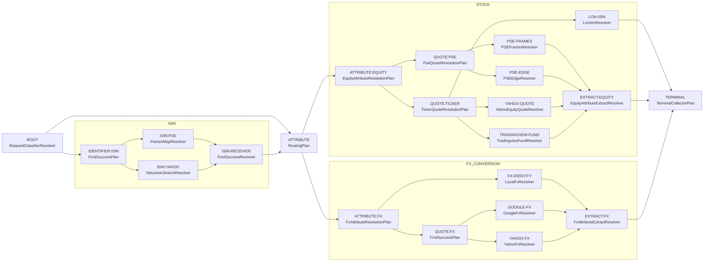

# Graph-Driven Execution

## Summary

This design tracks the graph-driven driver that executes the descriptive
routing graph directly, plus the remaining cleanup after that rollout.

The driver starts at ROOT, feeds the request forward through nodes, and follows
edges to the next node based on each node's output. When a node fails it
advances to the next fallback edge. Execution ends when TERMINAL is reached.

A dry-run of the same driver (no I/O, first-choice edges only) can produce an
inspectable planned path and route string, but this is a secondary capability —
a debug and introspection tool built on top of the driver, not a required step
before execution.

The end-state is that `ResolveFlow` stops containing routing-specific bootstrap
logic and hardcoded authored-id coupling. Most of that execution shift is now
done; the remaining work is cleanup and simplification around the live driver.

## Problem

The original runtime shape mixed two concerns:

- description of the routing graph
- runtime execution behavior

That mixed shape showed up in places such as:

- `selectLookupExecution` doing an ad-hoc partial dry-run by querying ROOT and
  RESOLVED-IDENTIFIER directly, then handing back pre-selected plan objects
- hard-coded awareness of authored ids like `RESOLVED-IDENTIFIER` in routing
  bootstrap logic
- try-each fallback sequencing hidden inside plan nodes rather than expressed
  as graph edges the driver can see
- route strings assembled as a side effect of execution rather than derived
  from an inspectable planned path

Current remaining gaps are smaller:

- some cleanup-oriented execution abstractions still remain around the driver,
  especially generic execution-context plumbing and resolver registration
- parts of this document now describe the current runtime accurately, but the
  long-tail cleanup work is still about removing the remaining authored-id and
  node-type coupling outside the graph boundaries

## Architectural Position

Current layer model:

1. authored DAG data
2. `ResolveFlow` exposing `Graph.View`
3. plan objects and request-resolution glue as partial executors

Active layer model:

1. authored DAG data
2. descriptive graph surface (`Graph.View`, exposed by `ResolveFlow`)
3. driver — executes the graph with real node calls, handles fallback

The descriptive graph remains the single shared surface for both inspection and
execution. There is no separate compiled execution graph model.

## Goals

- Replace `selectLookupExecution` and `LookupExecutionSelection` with a
  graph-driven driver.
- Keep the try-each fallback structure visible as graph edges rather than
  hidden inside plan nodes.
- Remove `ResolveFlow` bootstrap coupling to specific authored node ids.
- Preserve current routing behavior while changing where execution knowledge
  lives.

## Non-Goals

- Redesign routing semantics from scratch.
- Replace the current authored graph or `DagPlan` shape in this step.
- Redesign CLI graph rendering.
- Introduce browser/runtime-host changes.
- Solve every source-override and source-introspection design problem in the
  same pass.

## Design

### Driver

The driver starts at ROOT with the raw request and walks forward through the
graph. At each node it executes with real I/O and follows the appropriate next
edge based on the result. When a node returns `lookup_failure` it advances to
the next fallback edge. Execution ends when TERMINAL is reached or all options
are exhausted.

The try-each fallback structure is not hidden. It is real graph structure —
`QUOTE:TICKER → [LON-ISIN, YAHOO-QUOTE, TRADINGVIEW-FUND]` means try LON-ISIN
first (for LON exchange + isin requests), then YAHOO-QUOTE, then TRADINGVIEW-FUND
on failure. The driver follows these edges directly.

Historically, the hardcoded bootstrap work that `selectLookupExecution` split
between ROOT and the request-classification step was replaced by ordinary
driver execution from the graph entry point.

The driver should be implemented asynchronously from the start. An async driver
naturally supports parallel execution of independent branches — nodes with no
data dependency on each other can be dispatched concurrently — and fan-in,
where a downstream node waits for multiple upstream results before proceeding.
Starting async avoids a later rewrite when these patterns become needed.

### Dry-Run (Introspection)

Running the driver in no-I/O mode, following first-choice edges at every
branch, produces a best-case path and a planned route string. This is useful
for inspection and debugging but is not a required step before execution.
The driver logic is the same in both modes.

### Descriptive Routing Graph

The current graph as emitted by the TypeScript CLI:
`node tools/_shared/cli-ts.js --graph --output=mermaid`



### Worked Examples

These show the driver path for representative requests, assuming first-choice
success at every node.

#### Example 1: Direct Equity Quote — `GOOG price`

```
ROOT                     (direct resolution — outputs ResolvedRequest)
→ ATTRIBUTE:EQUITY
→ QUOTE:TICKER
→ YAHOO-QUOTE
→ EXTRACT:EQUITY
→ TERMINAL
```

If YAHOO-QUOTE returns `lookup_failure` the driver follows the next edge to
TRADINGVIEW-FUND and continues from there.

#### Example 2: ISIN Then Quote — `US02079K1079 price`

```
ROOT                     (ISIN input — outputs RequestInput)
→ IDENTIFIER:ISIN
→ ISIN:YAHOO
→ ISIN-RECEIVER
→ ATTRIBUTE:EQUITY
→ QUOTE:TICKER
→ YAHOO-QUOTE
→ EXTRACT:EQUITY
→ TERMINAL
```

The identifier-to-attribute handoff is an ordinary graph edge — not a special
`buildAttributePlan` callback.

#### Example 3: FX Pair — `EURUSD price` vs `USDUSD price`

```
EURUSD: ROOT → ATTRIBUTE:FX → QUOTE:FX → GOOGLE-FX → EXTRACT:FX → TERMINAL
USDUSD: ROOT → ATTRIBUTE:FX → FX-IDENTITY → EXTRACT:FX → TERMINAL
```

The driver picks different edges at ATTRIBUTE:FX based on what ROOT
produces. No special-case branching in the driver.

### End-State Rule

Execution should be completely driven by the graph and the driver.

More concretely:

- `selectLookupExecution` and `LookupExecutionSelection` are removed
- `ResolveFlow` no longer contains bootstrap logic that hard-codes authored ids
  beyond the graph entry point (ROOT)
- plan objects may still exist as graph nodes, but not as partial executors
  that the bootstrap layer calls directly
## Interfaces And Invariants

The implementation should make these boundaries explicit:

- descriptive graph interface — unchanged, remains `Graph.View`
- driver — walks the graph from ROOT, handles fallback via edges, owns execution

Important invariants:

- the driver must produce the same result as current execution for all
  representative requests
- fallback behavior must remain visible as graph structure, not hidden in
  node internals
- execution must no longer depend on authored-id bootstrap coupling outside ROOT

Open design questions for the next pass:

- what value type moves across edges between nodes of different kinds
  (classifier output → identifier input → attribute input)
- how the identifier-to-attribute handoff is represented as a graph edge
  rather than a callback
- where batching fits — whether it remains outside the driver or becomes a
  first-class driver optimization

## Rollout

1. ~~define the driver interface and the node execution contract~~ — done:
   graph topology updated (ISIN-RECEIVER, ISIN/STOCK/FX groups), ROOT absorbs
   `DirectIdentifierResolver` returning `ClassifiedInput`
2. ~~implement the driver for representative request families~~ — done
3. ~~wire the driver into `ResolveFlow.resolveAttribute` alongside the existing
   path~~ — done: parity verified across all 68 cases in `tools/parity-cases.txt`
   (68/68 pass, including US/Israeli/PSE/FX/ISIN-routed/preferred-REIT families)
4. ~~verify parity with existing integrated routing tests~~ — done
5. ~~remove the old pipeline~~ — done; `FlowEngine` is the only execution path
   in `ResolveFlow.resolveAttribute`; the `legacy` branch and `engine` option
   are gone

## Cleanup Plan

Remove remaining scaffolding left behind by the old execution model.
Work in passes:

### Pass 1 — move attribute projection into the graph (**done**)

- Add EXTRACT:EQUITY and EXTRACT:FX resolver nodes inside their respective
  subgraphs; each receives `{ quote, routeState }` on the edge from its
  upstream resolvers and calls `extractAttributeValue` directly
- Remove `projectFlowEngineValue` and its call to `selectLookupExecution`
- Run `check:ts` — `LookupExecutionSelection`, `selectLookupExecution`,
  `RequestResolutionDependencies`, and the remaining legacy planning
  infrastructure should surface as unused

### Pass 2+ — dead code elimination

- Delete each unused export/type/function the compiler flags
- Re-run `check:ts` after each deletion pass; new dead code will surface as
  previously-live callers are removed
- Repeat until `check:ts` reports no unused declarations
- If a symbol is nearly dead but removal requires non-trivial work (e.g. a
  public API surface, a partially-shared abstraction), note it here and skip it

### Followup items (nearly dead, non-trivial to remove)

#### ~~`selectLookupExecution` / `projectFlowEngineValue` stench~~ — addressed in Pass 1

~~`projectFlowEngineValue` in `resolve-flow.ts` still calls `env.selectLookupExecution`
to obtain `routeState` (for `extractAttributeValue`) and `requestInput.attributeType`
(for the isin branch). This keeps the entire `request-resolution-env.ts`,
legacy planning helpers, and `LookupExecutionSelection` infrastructure alive
even though the FlowEngine no longer uses them for routing.~~

Resolved by moving attribute projection into the graph (EXTRACT:EQUITY / EXTRACT:FX
nodes), which eliminates the need for `projectFlowEngineValue` and
`selectLookupExecution` entirely.

#### `RouteExecutionResolver` and `RouteJob` — obsolete abstraction (**in progress**)

`RouteExecutionResolver` is the base class for all concrete quote-fetching leaf
resolvers. Its name is a leftover from the old execution model where leaf
resolvers were tightly coupled to `RouteJob` and `RuntimePlan`.

Current status:

- Leaf execution now uses direct per-request execution (`executeRouteRequest`)
  and no longer executes through `executeBatch` in the live path
- Plan fallback traversal is owned by plan execution, not the old
  `executeRouteJobs` loop
- A transitional context object (`ResolverExecutionContext`) is still present
  and carries execution-side metadata (`attribute`, `routeKind`, `routeState`,
  `tickerInput`)

Follow-up for the next cleanup pass:

- collapse `ResolverExecutionContext` by moving remaining mutable
  `routeState` fields into explicit edge payloads between graph nodes
- remove the out-of-band `PlanRuntimeRefs` / `runtimeRefs` injection seam;
  if resolvers need graph runtime capabilities such as `callSubgraph(...)`,
  thread a graph runtime API through normal execution context instead of
  mutating resolver instances after construction
- remove now-unused `RouteJob`/`route-jobs.ts`/`route-execution.ts` exports and
  helpers once call sites are gone
- run `check:ts` after each deletion step and remove newly-surfaced unused
  symbols until clean

#### Resolver self-registration — eliminate `CONCRETE_RESOLVER_CLASSES_BY_NAME`

`CONCRETE_RESOLVER_CLASSES_BY_NAME` in `concrete-resolvers.ts` is an explicit
registry mapping class name strings to class objects. This is the JS equivalent
of listing every implementation in a factory — an OCP violation that requires
touching the map every time a new resolver is added.

The right fix is self-registration: each resolver class registers itself into a
shared neutral registry at module load time (e.g. a `@RegisterResolver` decorator
or an explicit `resolverRegistry.register(MyResolver)` call at the bottom of each
resolver file). `ResolveFlow` reads that registry without knowing what is in it.
The consumer (composition root) is still responsible for importing the resolver
modules to trigger registration, but no explicit map is maintained.

Defer until resolver classes are split into their own files or a decorator
pattern is adopted.

#### Evaluate async driver support for parallelism

The current driver executes synchronously, which keeps the control flow simple
but leaves no structured way to let independent graph paths run in parallel
once the graph grows more fan-out and fan-in edges.

Follow-up for a later design and implementation pass:

- evaluate making `FlowEngine` and the resolver execution contract async
- identify which graph patterns permit independent path execution and would
  benefit from parallel dispatch
- define how async execution should interact with fallback ordering, tracing,
  and error propagation
- confirm the runtime-host implications, especially Apps Script compatibility
  and whether any real parallelism would come from `Promise` structure alone or
  from host-specific batch primitives such as `UrlFetchApp.fetchAll(...)`

### Acceptance

- `check:ts` clean
- `npm run compare:modes -- --mode js-fe --cases-file tools/parity-cases.txt`
  still 68/68

## Test Plan

- preserve current integrated routing results for representative requests
- preserve current route strings where they are part of the public contract
