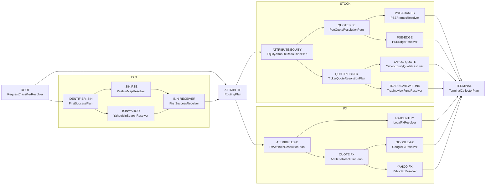

# Graph-Driven Execution

## Summary

Replace the current ad-hoc plan selection and execution scaffolding with a
driver that executes the descriptive routing graph directly.

The driver starts at ROOT, feeds the request forward through nodes, and follows
edges to the next node based on each node's output. When a node fails it
advances to the next fallback edge. Execution ends when TERMINAL is reached.

A dry-run of the same driver (no I/O, first-choice edges only) can produce an
inspectable planned path and route string, but this is a secondary capability —
a debug and introspection tool built on top of the driver, not a required step
before execution.

The end-state is that `ResolveFlow` stops containing routing-specific bootstrap
logic and hardcoded authored-id coupling. The driver owns execution.

## Problem

The current runtime shape still mixes two concerns:

- description of the routing graph
- runtime execution behavior

That mixed shape shows up in places such as:

- `selectLookupExecution` doing an ad-hoc partial dry-run by querying ROOT and
  RESOLVED-IDENTIFIER directly, then handing back pre-selected plan objects
- hard-coded awareness of authored ids like `RESOLVED-IDENTIFIER` and
  `ATTRIBUTE:FX` in `ResolveFlow` bootstrap logic
- try-each fallback sequencing hidden inside plan nodes rather than expressed
  as graph edges the driver can see
- route strings assembled as a side effect of execution rather than derived
  from an inspectable planned path

## Architectural Position

Current layer model:

1. authored DAG data
2. `ResolveFlow` exposing `Graph.View`
3. plan objects and request-resolution glue as partial executors

Active layer model:

1. authored DAG data
2. descriptive graph surface (`Graph.View`, exposed by `ResolveFlow`)
3. driver — executes the graph with real node calls, handles fallback

The descriptive graph remains the single shared surface for both inspection and
execution. There is no separate compiled execution graph model.

## Goals

- Replace `selectLookupExecution` and `LookupExecutionSelection` with a
  graph-driven driver.
- Keep the try-each fallback structure visible as graph edges rather than
  hidden inside plan nodes.
- Remove `ResolveFlow` bootstrap coupling to specific authored node ids.
- Preserve current routing behavior while changing where execution knowledge
  lives.

## Non-Goals

- Redesign routing semantics from scratch.
- Replace the current authored graph or `DagPlan` shape in this step.
- Redesign CLI graph rendering.
- Introduce browser/runtime-host changes.
- Solve every source-override and source-introspection design problem in the
  same pass.

## Design

### Driver

The driver starts at ROOT with the raw request and walks forward through the
graph. At each node it executes with real I/O and follows the appropriate next
edge based on the result. When a node returns `lookup_failure` it advances to
the next fallback edge. Execution ends when TERMINAL is reached or all options
are exhausted.

The try-each fallback structure is not hidden. It is real graph structure —
`QUOTE:TICKER → [YAHOO-QUOTE, TRADINGVIEW-FUND]` means try YAHOO-QUOTE first,
then TRADINGVIEW-FUND on failure. The driver follows these edges directly.

The hardcoded queries to ROOT and RESOLVED-IDENTIFIER that currently live in
`selectLookupExecution` become ordinary driver steps — ROOT is just the first
node, and RESOLVED-IDENTIFIER is reached when the graph routes there.

The driver should be implemented asynchronously from the start. An async driver
naturally supports parallel execution of independent branches — nodes with no
data dependency on each other can be dispatched concurrently — and fan-in,
where a downstream node waits for multiple upstream results before proceeding.
Starting async avoids a later rewrite when these patterns become needed.

### Dry-Run (Introspection)

Running the driver in no-I/O mode, following first-choice edges at every
branch, produces a best-case path and a planned route string. This is useful
for inspection and debugging but is not a required step before execution.
The driver logic is the same in both modes.

### Descriptive Routing Graph

The current graph as emitted by the TypeScript CLI:
`node tools/_shared/cli-ts.js --graph --output=mermaid`



### Worked Examples

These show the driver path for representative requests, assuming first-choice
success at every node.

#### Example 1: Direct Equity Quote — `GOOG price`

```
ROOT                     (direct resolution — outputs ResolvedRequest)
→ ATTRIBUTE:EQUITY
→ QUOTE:TICKER
→ YAHOO-QUOTE
→ TERMINAL
```

If YAHOO-QUOTE returns `lookup_failure` the driver follows the next edge to
TRADINGVIEW-FUND and continues from there.

#### Example 2: ISIN Then Quote — `US02079K1079 price`

```
ROOT                     (ISIN input — outputs RequestInput)
→ IDENTIFIER:ISIN
→ ISIN:YAHOO
→ ISIN-RECEIVER
→ ATTRIBUTE:EQUITY
→ QUOTE:TICKER
→ YAHOO-QUOTE
→ TERMINAL
```

The identifier-to-attribute handoff is an ordinary graph edge — not a special
`buildAttributePlan` callback.

#### Example 3: FX Pair — `EURUSD price` vs `USDUSD price`

```
EURUSD: ROOT → ATTRIBUTE:FX → QUOTE:FX → GOOGLE-FX → TERMINAL
USDUSD: ROOT → ATTRIBUTE:FX → FX-IDENTITY → TERMINAL
```

The driver picks different edges at ATTRIBUTE:FX based on what ROOT
produces. No special-case branching in the driver.

### End-State Rule

Execution should be completely driven by the graph and the driver.

More concretely:

- `selectLookupExecution` and `LookupExecutionSelection` are removed
- `ResolveFlow` no longer contains bootstrap logic that hard-codes authored ids
  beyond the graph entry point (ROOT)
- plan objects may still exist as graph nodes, but not as partial executors
  that the bootstrap layer calls directly
## Interfaces And Invariants

The implementation should make these boundaries explicit:

- descriptive graph interface — unchanged, remains `Graph.View`
- driver — walks the graph from ROOT, handles fallback via edges, owns execution

Important invariants:

- the driver must produce the same result as current execution for all
  representative requests
- fallback behavior must remain visible as graph structure, not hidden in
  node internals
- execution must no longer depend on authored-id bootstrap coupling outside ROOT

Open design questions for the next pass:

- what value type moves across edges between nodes of different kinds
  (classifier output → identifier input → attribute input)
- how the identifier-to-attribute handoff is represented as a graph edge
  rather than a callback
- where batching fits — whether it remains outside the driver or becomes a
  first-class driver optimization

## Rollout

1. ~~define the driver interface and the node execution contract~~ — done:
   graph topology updated (ISIN-RECEIVER, ISIN/STOCK/FX groups), ROOT absorbs
   `DirectIdentifierResolver` returning `ClassifiedInput`
2. ~~implement the driver for representative request families~~ — done
3. ~~wire the driver into `ResolveFlow.resolveAttribute` alongside the existing
   path~~ — done: parity verified across all 68 cases in `tools/parity-cases.txt`
   (68/68 pass, including US/Israeli/PSE/FX/ISIN-routed/preferred-REIT families)
4. ~~verify parity with existing integrated routing tests~~ — done
5. **remove the old pipeline** — current focus; see plan below

## Cleanup Plan

Remove the legacy pipeline and all code it made reachable. Work in passes:

### Pass 1 — delete the old execution path

- Remove the `legacy` branch from `ResolveFlow.resolveAttribute` and the
  `engine` option; make `flow-engine` the only path
- Remove `selectLookupExecution`, `LookupExecutionSelection`, and any
  scaffolding that only existed to support the legacy branch
- Run `check:ts` — TypeScript will surface the first wave of now-unused exports
  and types

### Pass 2+ — dead code elimination

- Delete each unused export/type/function the compiler flags
- Re-run `check:ts` after each deletion pass; new dead code will surface as
  previously-live callers are removed
- Repeat until `check:ts` reports no unused declarations
- If a symbol is nearly dead but removal requires non-trivial work (e.g. a
  public API surface, a partially-shared abstraction), note it here and skip it

### Followup items (nearly dead, non-trivial to remove)

#### Direct ISIN attribute resolution (LON:, PSE: with `isin` attribute)

`resolveDirectIsinAttributeValue` in `isin-lookup.ts` handles requests like
`LON:SJPA, isin` and `PSE:BDO, isin` by fetching the ISIN directly from the
exchange (LSE or PSE site) without going through a Yahoo quote fetch.

The legacy `resolveRequestValue` path called this as a short-circuit before
invoking any resolvers. The FlowEngine has no equivalent node — these tickers
route through the standard equity quote path, which fails when the mock or
real environment only provides the LSE/PSE URL, not a Yahoo quote.

The test `"HOODLEFINANCE supports direct ISIN attribute lookups that only need
fetchText"` in `appscript.test.js` is marked `todo` pending a graph node that
handles this case (e.g. a new `ISIN-DIRECT` leaf node checked before the quote
path, or a pre-engine hook in `resolveAttribute`).

### Acceptance

- `check:ts` clean
- `npm run compare:modes -- --mode js-fe --cases-file tools/parity-cases.txt`
  still 68/68

## Test Plan

- preserve current integrated routing results for representative requests
- preserve current route strings where they are part of the public contract
