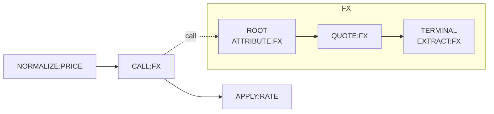

# Subgraph Call Support

## Summary

Add a first-class subgraph call primitive to the graph runtime so reusable graph
fragments can be invoked by name with explicit input and output boundaries.

This should be delivered as independent infrastructure work with its own test
coverage before any existing runtime caller is migrated to use it.

The proposed design introduces a reusable subgraph definition plus a call
surface that can invoke that subgraph without copying its internal nodes into
multiple caller branches.

## Problem

The current runtime has no first-class way to express reusable graph fragments.

Today reuse is effectively modeled as an implementation-detail jump into a
specific authored node id and then back out through implicit runtime behavior.

That shape has several problems:

- reuse depends on authored node ids rather than on an explicit graph contract
- callers must know where the reusable behavior starts and ends
- the runtime treats reuse as a disguised mid-graph jump
- tracing and future batching cannot distinguish normal graph flow from an
  internal subgraph invocation
- changing the internal FX branch shape risks breaking callers that are coupled
  to specific node ids

## Goals

- Make reusable graph fragments callable by name rather than by arbitrary node
  id.
- Keep the subgraph boundary explicit: callers provide input, callees return
  output, internal nodes stay encapsulated.
- Make Mermaid graph rendering able to represent subgraph call semantics
  without flattening them back into an indistinguishable mid-graph jump.
- Land subgraph-call support as a standalone runtime capability with tests,
  without requiring immediate migration of existing callers.
- Keep future batching viable by making repeated reusable work visible as the
  same runtime operation.

## Non-Goals

- Redesign the entire authored DAG format in one pass.
- Introduce full graph functions, recursion, or arbitrary nested graph
  composition immediately.
- Solve all future batching requirements in this document.
- Make arbitrary `executeFromNodeId(...)` jumps a permanent public primitive.
- Replace all existing runtime refs at once.
- Migrate existing production call sites in the same change that introduces
  subgraph-call support.

## Proposed Design

### Design Direction

The runtime should model reuse as a named subgraph invocation, not as a jump to
an authored node id.

The conceptual call shape is:

```text
caller value
  -> adapt to subgraph input
  -> invoke named subgraph
  -> adapt subgraph output back to caller value
```

The reusable thing is the subgraph definition, not a specific live node
instance.

### New Primitive: Subgraph Call

Add a runtime primitive with the following semantics:

- the caller references a named subgraph
- the subgraph has one declared root node and one declared terminal node
- the caller provides explicit input to the subgraph
- the subgraph runs in its own invocation context
- the caller receives an explicit result value back
- the caller may incorporate the subgraph segment into its own trace, but that
  segment must remain marked as a subgraph call boundary
- a single node may declare more than one potential subgraph call in the
  authored graph data

The key point is that the caller does not name internal authored nodes
directly.

### Subgraph Definition Shape

Subgraphs should be declared explicitly in the authored graph data to be valid
as subgraphs. Node membership continues to use the existing `group` field, and
graph-level subgraph metadata upgrades some groups into callable subgraphs. A
subgraph is therefore not inferred from runtime-only convention.

Subgraph ids are a subset of group ids: a subgraph id is valid only if there is
an explicit subgraph declaration for that group in the authored graph data.

When a production caller is later migrated, the runtime can point these
boundaries at nodes that already exist in the authored DAG. This keeps the
first caller migration small while making the call-site contract explicit.

The standalone support work should also validate that the declared root and
terminal nodes are structurally connected and belong to the declared group. A
subgraph declaration is invalid if the terminal node is not reachable from the
root node.

A minimal authored spec shape could look like:

```ts
{
  "NORMALIZE:PRICE": {
    group: "STOCK",
    id: "NORMALIZE:PRICE",
    subgraphCalls: ["FX"],
    type: "NormalizePricePlan",
  },
  "ATTRIBUTE:FX": {
    group: "FX",
    id: "ATTRIBUTE:FX",
    type: "FxAttributeResolutionPlan",
  },
  "EXTRACT:FX": {
    group: "FX",
    id: "EXTRACT:FX",
    type: "FxAttributeExtractResolver",
  },
  "__subgraphs__": {
    "FX": {
      rootNodeId: "ATTRIBUTE:FX",
      terminalNodeId: "EXTRACT:FX",
    },
  },
}
```

In this shape, `group: "FX"` expresses membership in the reusable body, while
the explicit `__subgraphs__.FX` declaration upgrades that group into a callable
subgraph with validated boundaries.

Longer term, the runtime may choose to let subgraphs own dedicated node sets or
to compile a subgraph registry from a richer authored definition.

### Runtime Surface

The standalone support work adds this new reusable primitive:

```ts
interface GraphRuntimeApi {
  callSubgraph(subgraphId: string, inputValue: unknown): LookupResult;
}
```

Existing compatibility refs can adopt this primitive later in separate
migration work.

Authored graph data should also declare which nodes may invoke named
subgraphs by adding an optional `subgraphCalls?: string[]` field to
`Graph.Node`.

Example node shape:

```ts
"ATTRIBUTE:EQUITY": {
  group: "STOCK",
  id: "ATTRIBUTE:EQUITY",
  next: ["QUOTE:PSE", "QUOTE:TICKER"],
  subgraphCalls: ["FX"],
  type: "EquityAttributeResolutionPlan",
}
```

This keeps subgraph-call semantics in the authored graph data rather than
hiding them in resolver code or runtime-only helper logic.

### ResolveFlow Ownership

`ResolveFlow` should own the mapping from subgraph id to runtime call
boundary.

Initial shape:

```ts
interface ResolveFlowSubgraphRegistry {
  [subgraphId: string]: {
    rootNodeId: string;
    terminalNodeId: string;
  };
}
```

`ResolveFlow` then exposes a helper conceptually like:

```ts
callSubgraph(subgraphId: string, inputValue: unknown): LookupResult
```

That helper is responsible for:

- resolving the named subgraph
- executing from the subgraph's declared root node
- stopping at the subgraph's declared terminal node
- returning a result in the same success/failure envelope style as other graph
  runtime API calls
- letting the caller adapt the subgraph result and then continue its own normal
  execution semantics

### FlowEngine Role

The initial standalone support phase does not require a large `FlowEngine`
redesign.

Short-term approach:

- keep the existing synchronous execution engine
- let `ResolveFlow` own subgraph identity and registry lookup
- let `FlowEngine` own bounded execution mechanics
- add an explicit bounded execution path that can start at a declared root and
  stop at a declared terminal
- treat `executeFromNodeId(...)` as deprecated compatibility machinery, not as
  the new subgraph abstraction

Longer-term direction:

- remove `executeFromNodeId(...)` once FX migration no longer depends on the
  old compatibility seam
- give `FlowEngine` explicit subgraph invocation support rather than raw
  mid-graph entry as the main reuse primitive
- extend the existing basic visited-node trace with structured nested subgraph
  call tracing
- make batching and scheduling aware of subgraph invocation boundaries

This staged approach keeps the first implementation small while moving the
architecture toward a principled engine primitive.

### Mermaid And Rendering Semantics

The graph visualization must be able to represent subgraph call semantics.

This matters for two reasons:

- the current Mermaid output is the canonical visualization format for the
  TypeScript CLI and docs
- if subgraph calls are not representable in Mermaid, the rendered graph will
  continue to hide the distinction between a named reusable call and an
  implementation-detail jump into an internal node id

The rendering requirement is therefore part of the design, not a later
documentation nicety.

The renderer should make these semantics visible:

- a caller invokes a named subgraph
- the callee is a reusable graph fragment with its own explicit boundary
- the call edge is distinct from ordinary in-graph dataflow edges
- the subgraph's root and terminal are visible in the rendering

In the standalone support pass, Mermaid does not need to render nested execution traces or
runtime call stacks. It only needs to show that a node is a subgraph call and
which named subgraph it targets.

The design should preserve compatibility with the current rendering model in
[`resolve-flow-rendering.md`](./resolve-flow-rendering.md): Mermaid remains the
canonical render format, and rendering still prefers stable topology-oriented
output over request-specific runtime detail.

Two acceptable initial Mermaid strategies are:

1. A call node plus a labeled edge to a named subgraph boundary.
2. A call node labeled with the target subgraph id, while the reusable
   subgraph body is rendered separately in the same Mermaid document.

Existing node `group` metadata can continue to show that nodes belong to the
same reusable region. Callable-subgraph semantics come from explicit
graph-level subgraph declarations, and call-site invocation comes from explicit
node-level `subgraphCalls` declarations in that same authored graph data. The
rendering should make three things visible separately:

- reusable-body membership
- explicit subgraph boundaries, especially root and terminal
- call-site invocation of a named subgraph

The first strategy would look conceptually like. The dashed call edge is an
invocation annotation, not an ordinary `next` edge, and the solid
`CALL:FX -> APPLY:RATE` edge represents caller-side continuation after the
subgraph result has been returned and adapted:



The exact Mermaid syntax does not need to be finalized in this design note.
What matters is the semantic requirement:

- ordinary `next` edges and subgraph-call edges must be distinguishable in the
  rendered graph
- the rendered graph must show named subgraph boundaries rather than only the
  implementation nodes inside them

This requirement implies that the renderer will likely need some subgraph-aware
metadata in addition to the current plain `Graph.Node.next` topology. That does
not require redesigning `Graph.View` immediately, but it should be treated as a
first-class output requirement for the subgraph-call feature. In the first
pass, that metadata should come from authored graph data plus subgraph
declarations, rather than from runtime inference.

### Independent Delivery Requirement

Subgraph-call support should be introduced as independent infrastructure.

That means the first implementation should:

- add the runtime primitive
- add the rendering support
- add dedicated tests
- leave the current FX compatibility path in place

Only after that groundwork is merged should the current FX compatibility hook
be ported to the new primitive.

This keeps the new abstraction reviewable on its own and avoids conflating two
different questions:

- whether subgraph-call support is a sound runtime primitive
- whether the first production migration onto that primitive is the right one

## Interfaces And Invariants

### Interfaces

Standalone support additions:

```ts
interface GraphRuntimeApi {
  callSubgraph(subgraphId: string, inputValue: unknown): LookupResult;
}

export namespace Graph {
  export interface Node {
    id: string;
    type: string;
    next?: string[];
    group?: string;
    subgraphCalls?: string[];
  }
}
```

Potential future node/config surface:

```ts
export namespace Graph {
  export interface Subgraph {
    rootNodeId: string;
    terminalNodeId: string;
  }
}
```

### Invariants

- callers must not reference internal authored node ids of reusable graph
  fragments directly
- each named subgraph must declare exactly one root node and one terminal node
- each named subgraph must be connected, with the terminal node reachable from
  the root node
- subgraphs must be declared explicitly in the graph data to be valid as
  subgraphs
- subgraph ids are a subset of group ids and are defined by the explicit
  subgraph section in the authored graph data
- subgraph membership comes from the existing node `group` field
- root and terminal nodes must belong to the group identified by the
  subgraph's id
- nodes that may invoke subgraphs must declare those potential calls in the
  authored graph data
- existing grouped regions in `DagPlan` are not automatically callable
  subgraphs
- subgraph invocation must preserve the current success/failure envelope model
- Phase 1 subgraph support remains synchronous
- the caller may merge the subgraph segment into its own trace, but that
  segment must remain distinguishable as a subgraph call
- Mermaid rendering must be able to distinguish a subgraph call from an
  ordinary graph edge
- a subgraph call must not mutate the caller's routing context implicitly
  without an explicit adapter contract
- `executeFromNodeId(...)` is deprecated compatibility machinery and must stop
  being the conceptual reuse primitive

## Rollout And Operations

### Phase 1: Introduce Named Subgraph Calls As Standalone Infrastructure

- add a subgraph registry owned by `ResolveFlow`
- add `callSubgraph(...)` to the graph runtime API
- add bounded synchronous subgraph execution support in `FlowEngine`
- add Mermaid/rendering support for subgraph-call semantics
- add tests that validate the new primitive without changing existing call
  sites

Phase 1 intentionally does not migrate existing production call sites.

### Phase 2: Promote Subgraph Calls To An Engine Concept

- add structured subgraph invocation support to `FlowEngine`
- extend the existing basic trace so nested subgraph calls are explicit
- evaluate batching and caching behavior at the subgraph boundary

## Test Plan

- unit test that a named subgraph can be registered and invoked through
  `ResolveFlow.callSubgraph(...)`
- unit test that unknown subgraph ids fail with a clear error
- unit test that a node-level `subgraphCalls` declaration fails when it
  references an undeclared subgraph id
- unit test that subgraph registration fails when the declared terminal node is
  unreachable from the declared root node
- unit test that subgraph registration fails when the declared root or terminal
  node does not belong to the declared group
- renderer test that Mermaid output shows subgraph-call edges or call nodes in
  a way that is distinguishable from ordinary `next` edges
- trace test that a subgraph invocation records a distinct call boundary in the
  existing basic trace

## Open Questions

- Should the first subgraph contract return a bare numeric rate or a structured
  conversion result object?
- Should input/output adapters be explicit spec objects, or should the first
  pass keep adaptation logic in code?
- When batching is added, should batching attach to repeated subgraph calls or
  to provider leaf nodes underneath the subgraph?
